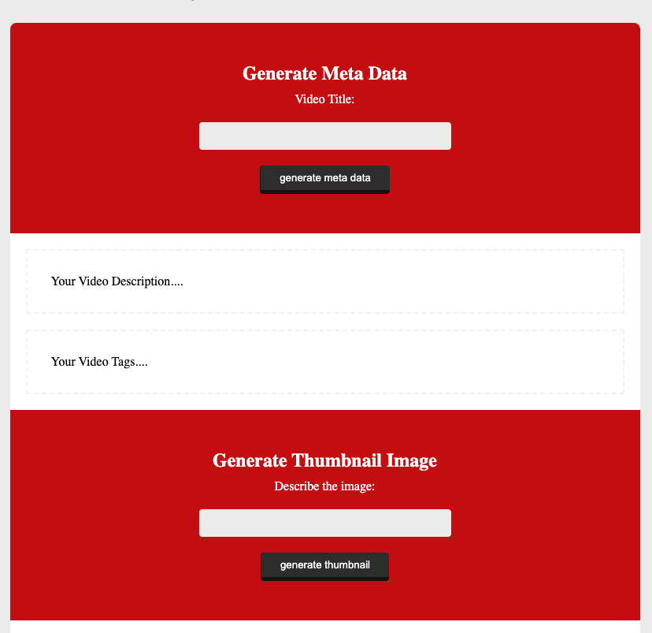

# Project Title

A Simple App using OpenAI's chat completion and image generation features.

The app has two inputs one of which accepts a YouTube Title and then it generates some meta data for that title with some tags

The other input accepts an image description and then a 512x521 image is generated for you based on the description given.


## Authors

- [Theophilus Adukpo](https://www.github.com/theoadu)


## Environment Variables

To run this project, you will need to add the following environment variables to your .env file

`OPENAI_API_KEY`


## Run Locally

Clone the project

```bash
  git clone https://github.com/Theoadu/openai.git
```

Go to the project directory

```bash
  cd openai
```

Install dependencies

```bash
  yarn install
```

Start the server

```bash
  node app
```


## Screenshots




## Features

- chat Completion
- Image Completion


